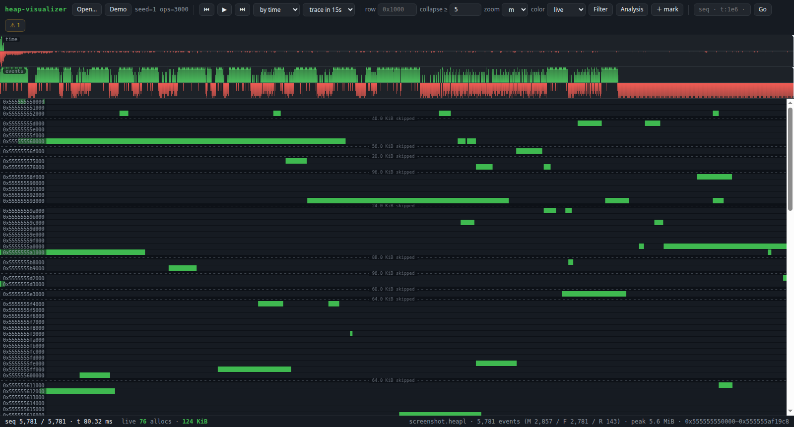
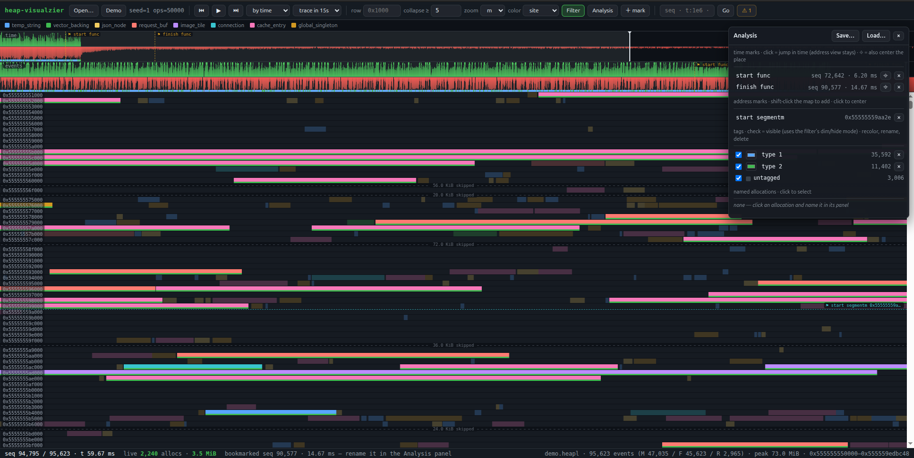

# heap-visualizer

Heap allocation visualizer: renders a `.heapl` (JSONL) stream of
malloc/free/realloc events on an address-line map with two coordinated
timelines (temporal and sequential) and full time-travel.

Parsing, seeking, and rasterization happen in a Rust - WebAssembly core
running in a Web Worker with OffscreenCanvas; the page stays fully
client-side.

Supports analyzing heap-traces, tagging, and naming allocations, marking timestamps and addresses - and saving analysis into a `.heapa` file for later work.





## Build & run

```sh
./build.sh                     # everything the browser needs, into dist/: the wasm
                               # (needs the wasm32-unknown-unknown target: rustup
                               # target add wasm32-unknown-unknown), the web layer,
                               # and a generated demo trace
./build.sh web                 # skip cargo; refresh only the web layer
./serve.py                     # static server over dist/
# open http://localhost:8630  (or ...?trace=demo.heapl to autoload)
```

`dist/` is a build product and is gitignored: everything hand-written lives
under `src/`, everything generated under `dist/`.

To build and export a reusable Rust image with the WASM target preinstalled:

```sh
./build-docker.sh             # images/heap-visualizer-wasm-builder.tar
docker run --rm -v "$PWD:/work" heap-visualizer-wasm-builder \
  cargo build --release --target wasm32-unknown-unknown \
  --manifest-path src/core/Cargo.toml
```

Once the builder image is available, build and stage the project WASM with:

```sh
./build-wasm-docker.sh         # dist/heap_visualizer_core.wasm
```

Drop any `.heapl` file onto the page to load it.

## Analysis workflow

- **Shift-drag** a range on either timeline to select it, then **Zoom** into it
  or **Tag** every allocation created in it. With a filter active, only
  allocations the filter matches get tagged — the filter defines the working
  set.
- Click an allocation to open its panel: give it a **name**, a **tag**, or a
  **highlight color** (shown in every color mode).
- **＋ mark** (or `m`) bookmarks the current playhead position; time marks show
  as flags on both timelines. Clicking one jumps in time while the address
  view stays put; the ⌖ button (or shift+click on the flag) also centers
  where the event happened.
- **Shift-click** the address map to drop an **address mark** — a named
  horizontal flag line; click it (or its Analysis-panel entry) to center that
  address at any playhead. `g` focuses the jump box, which accepts a seq,
  `t:` time, or `0x…` address.
- The **Analysis** panel lists bookmarks, tags (visibility filter, recolor,
  rename, delete) and named allocations, and **saves/loads** the whole thing
  as a `.heapa.json` file — dropping one onto the page restores the analysis.
- The **collapse ≥** box controls empty-row collapsing: a plain number is a
  run length in rows (e.g. `5`), a byte size (`64k`, `0x10000`) is empty
  address space — byte thresholds adapt when the row width changes.
- Color modes: live, site, thread, size (log ramp), age (log-normalized vs
  the oldest live allocation), tag. Tagged allocations keep a colored stripe
  in every mode, and both timelines carry a tag lane along the bottom.

## Tests

```sh
cargo test --manifest-path src/core/Cargo.toml   # engine, native, no wasm
node --test 'src/web/**/*.test.js'               # JS, no npm, no browser
```

Rendering and pointer interaction are hand-verified against the demo trace;
see [docs/decisions/D001](docs/decisions/D001-web-changes-are-hand-smoke-tested.md).

## Layout

- `src/core/` — Rust WASM engine (JSONL parser, columnar store, snapshot seeks,
  address-line raster, timeline binning). Plain C ABI, no wasm-bindgen.
- `src/web/` — the viewer's sources: `worker.js` owns the WASM + canvases,
  `main.js` is DOM chrome and input, `shell/` is the domain-independent
  window/drawer layer and `heap/` is everything that knows what an allocation
  is.
- `dist/` — what is actually served. Generated by `./build.sh`; not in git.
- `gen.py` — deterministic synthetic trace generator.
- `spec/` — the specification, split into modules (start at
  [spec/README.md](spec/README.md)).
- `docs/` — how work is done here. Start at [docs/now.md](docs/now.md).
